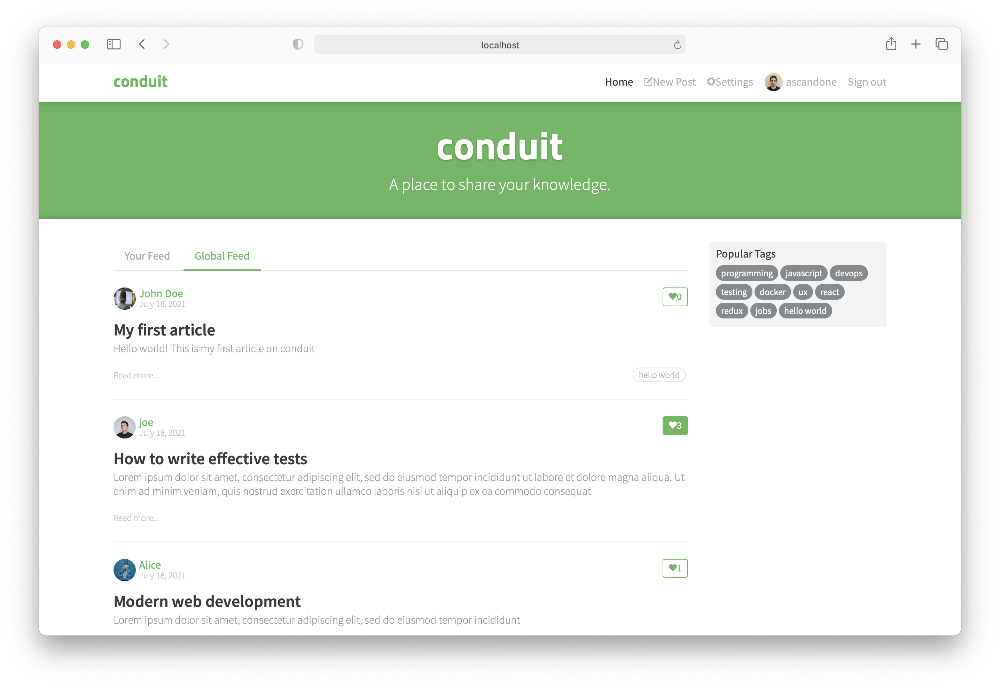
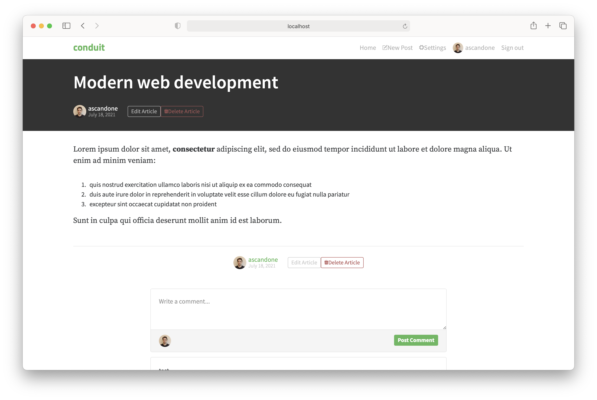
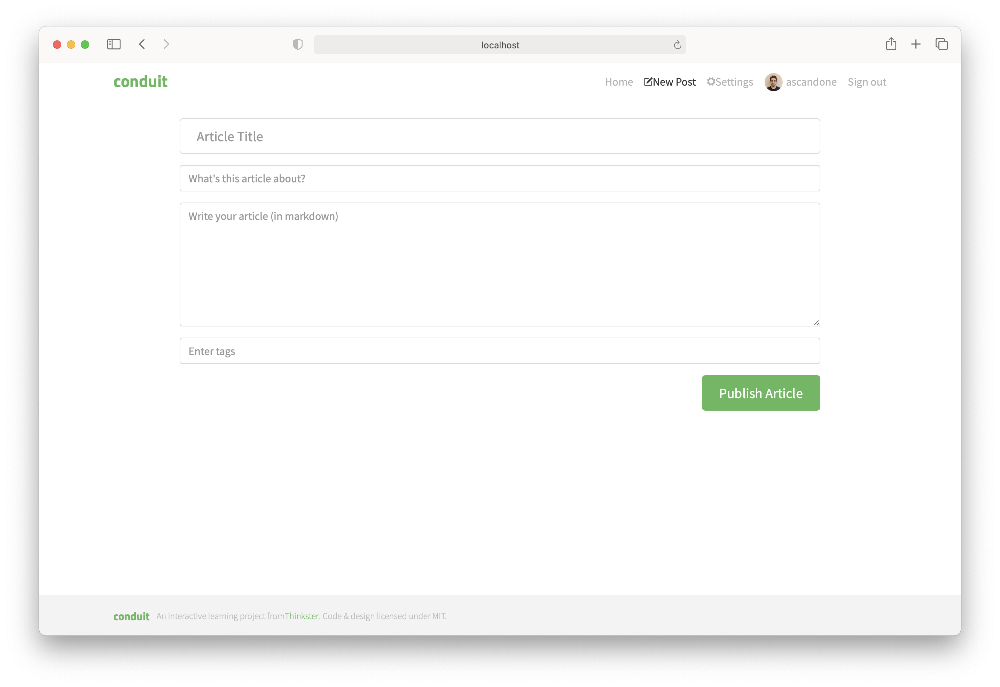
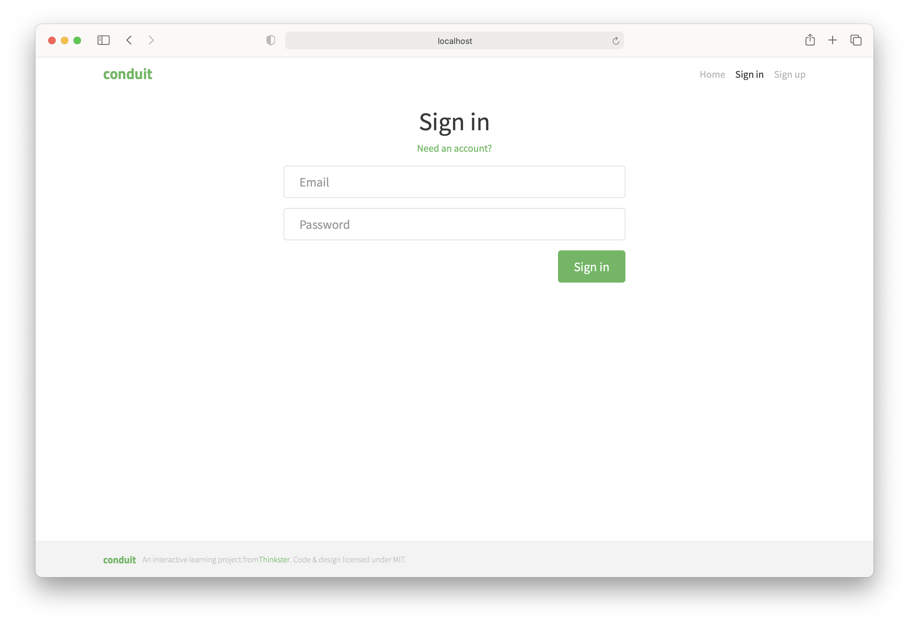
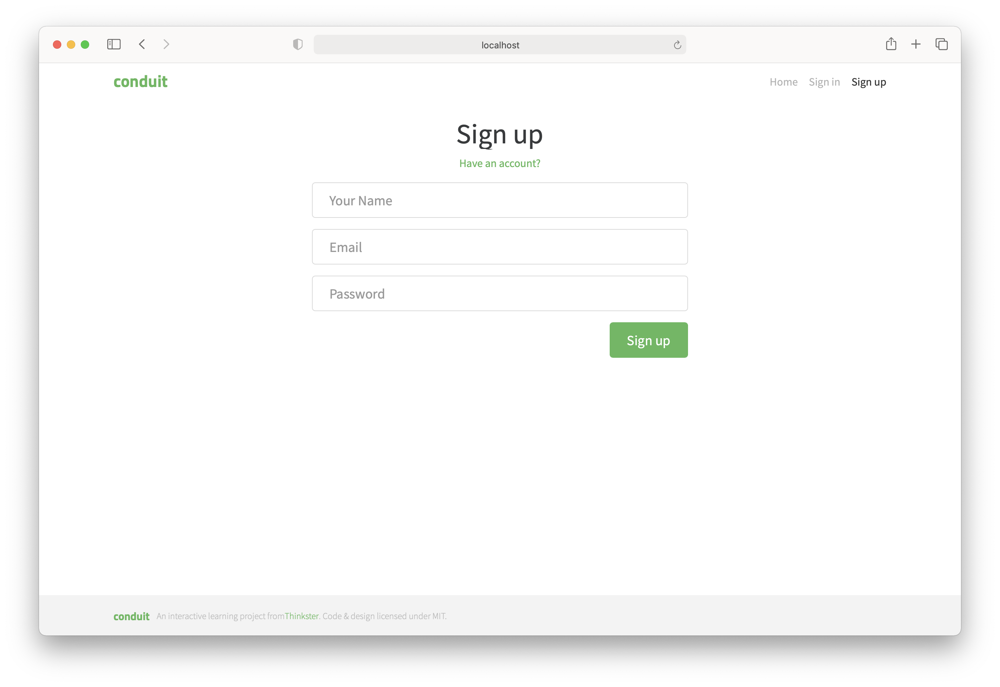
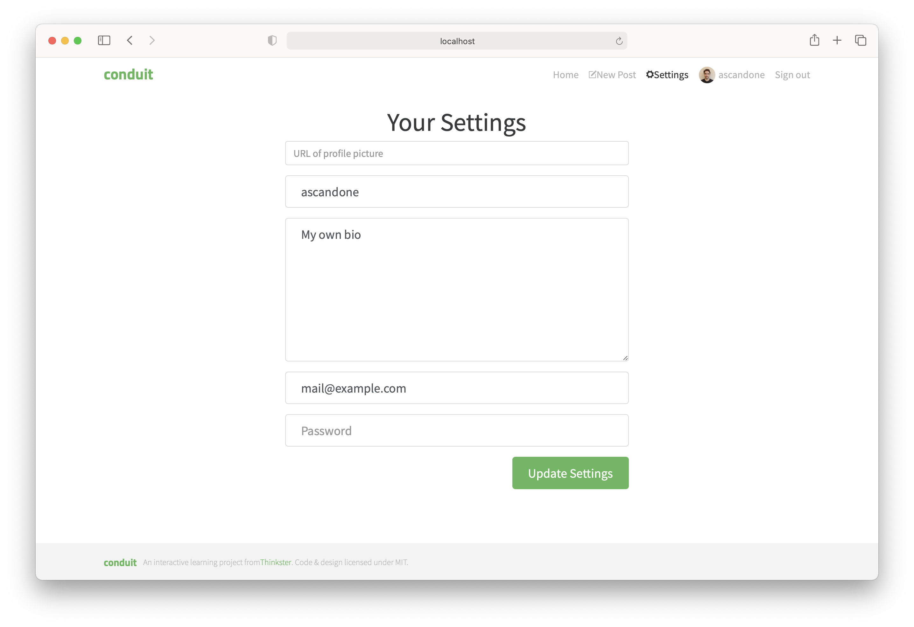

# Conduit

Elm implementation of the front-end of Conduit (a medium clone) according to its [specification](https://github.com/gothinkster/realworld)

> **warning** data is fetched from conduit server, infinite loadings or inappropriate content are not related to this codebase

## Pages and functionality:

### Home

Functionality:

- Pagination
- Like post
- Multiple tabs
  - Personal feed (if logged)
  - Global feed
  - Tag

### View Post

Functionality:

- Parsing markdown
- Favorite post
- Follow author
- Post comment
- Read comments
- Edit comment (if logged in)
- Delete post (if logged in)
- Edit post (if logged in)

### Create/Edit post

### Login/Register

### Settings

